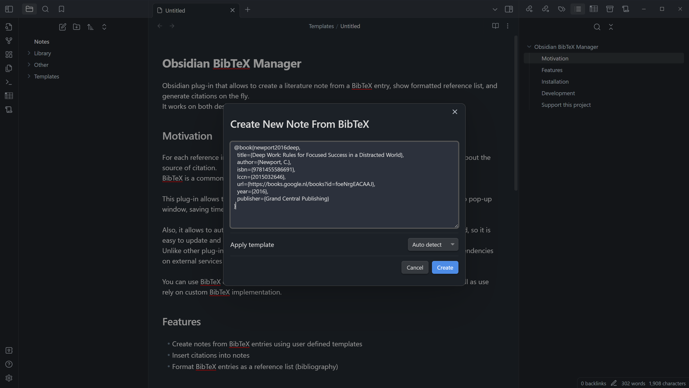

# Obsidian BibTeX Manager



Obsidian plug-in that simplifies the process of managing academic references by enabling the creation of literature notes from a BibTeX entry, 
displaying formatted reference lists, and generating citations instantly. 

This plug-in operates seamlessly on both desktop and mobile platforms, and does not require external dependencies.

## Motivation

For each reference in Obsidian I create a dedicated literature note that contains meta information about the source of citation. BibTeX is a common way to store references in academic writing,
that is why I decided to create a plug-in that would allow me to easily create literature notes just by copy and pasting the entry and save time on manual data entry. 

The plug-in also supports automatic formatting of reference lists within the note, while keeping the original BibTeX entry unmodified. I use this feature to keep source BibTeX file unmodified, 
while having a nicely formatted reference list in the note. 

Unlike other plug-ins, I support mobile platform as a "first-class citizen", meaning there are no dependencies on external services or desktop-only features.

You can use BibTeX entries from Zotero, Mendeley, or any other popular reference managers, as well as use rely on custom BibTeX implementation.

## Features

- Generate literature notes from BibTeX entries using customizable templates. This feature allows for the quick and easy organization of academic references.
- Automatically format your BibTeX entries as a reference list, creating a well-organized bibliography within your notes.
- Insert citations directly into your notes.

## Installation

1. Open Obsidian Settings.
2. In the side menu, select Community plugins.
3. Select Browse and put "Obsidian BibTeX Manager" into search box.
4. Select Install.
5. Go to plugin settings and setup path to custom templates.

## Development

This plugin is in active development. If you have any feature requests or bug reports, please open an issue on the GitHub repository.

```bash
make help # Show available commands
```
## Support this project

You can support this project by starring, sharing, and contributing to the codebase.

You can also support the author by buying him a coffee. Click sponsor button on the top of the page.
